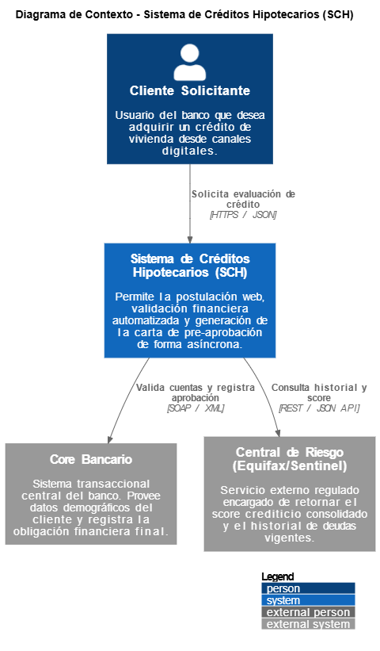

# Modelo C4 - Nivel 1: Contexto del Sistema

Este diagrama de contexto establece los límites del **Sistema de Créditos Hipotecarios (SCH)**, mostrando cómo interactúa con los usuarios del banco y con los sistemas periféricos (tanto internos como externos) que forman parte del ecosistema financiero.

## Diagrama de Contexto Visual



---

## Código Fuente de la Arquitectura (PlantUML)

El siguiente código respalda el diagrama superior, cumpliendo con el estándar de arquitectura como código para su futura mantenibilidad:

```plantuml
@startuml
!include [https://raw.githubusercontent.com/plantuml-stdlib/C4-PlantUML/master/C4_Context.puml](https://raw.githubusercontent.com/plantuml-stdlib/C4-PlantUML/master/C4_Context.puml)

LAYOUT_WITH_LEGEND()

title Diagrama de Contexto - Sistema de Créditos Hipotecarios (SCH)

Person(cliente, "Cliente Solicitante", "Usuario del banco que desea adquirir un crédito de vivienda desde canales digitales.")

System(sch, "Sistema de Créditos Hipotecarios (SCH)", "Permite la postulación web, validación financiera automatizada y generación de la carta de pre-aprobación de forma asíncrona.")

System_Ext(core, "Core Bancario", "Sistema transaccional central del banco. Provee datos demográficos del cliente y registra la obligación financiera final.")

System_Ext(centralRiesgo, "Central de Riesgo (Equifax/Sentinel)", "Servicio externo regulado encargado de retornar el score crediticio consolidado y el historial de deudas vigentes.")

Rel(cliente, sch, "Solicita evaluación de crédito", "HTTPS / JSON")
Rel(sch, centralRiesgo, "Consulta historial y score", "REST / JSON API")
Rel(sch, core, "Valida cuentas y registra aprobación", "SOAP / XML")
@enduml