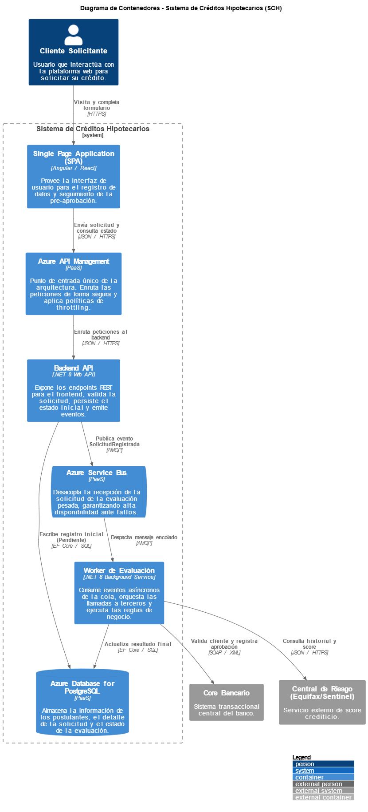

# Modelo C4 - Nivel 2: Contenedores

En este nivel hacemos un "zoom" dentro del Sistema de Créditos Hipotecarios (SCH) para visualizar sus contenedores principales. Aquí se exponen las decisiones tecnológicas clave, migrando hacia componentes administrados en la nube para asegurar escalabilidad y alta disponibilidad.

## Diagrama de Contenedores Visual



---

## Código Fuente de la Arquitectura (PlantUML)

El siguiente código respalda el diagrama superior, estructurado bajo el estándar C4-PlantUML:

```plantuml
@startuml
!include <C4/C4_Container>

LAYOUT_WITH_LEGEND()

title Diagrama de Contenedores - Sistema de Créditos Hipotecarios (SCH)

Person(cliente, "Cliente Solicitante", "Usuario que interactúa con la plataforma web para solicitar su crédito.")

System_Ext(core, "Core Bancario", "Sistema transaccional central del banco.")
System_Ext(centralRiesgo, "Central de Riesgo (Equifax/Sentinel)", "Servicio externo de score crediticio.")

System_Boundary(sch, "Sistema de Créditos Hipotecarios") {
    Container(spa, "Single Page Application (SPA)", "Angular / React", "Provee la interfaz de usuario para el registro de datos y seguimiento de la pre-aprobación.")
    Container(apiGw, "Azure API Management", "PaaS", "Punto de entrada único de la arquitectura. Enruta las peticiones de forma segura y aplica políticas de throttling.")
    Container(backendApi, "Backend API", ".NET 8 Web API", "Expone los endpoints REST para el frontend, valida la solicitud, persiste el estado inicial y emite eventos.")
    ContainerDb(db, "Azure Database for PostgreSQL", "PaaS", "Almacena la información de los postulantes, el detalle de la solicitud y el estado de la evaluación.")
    ContainerQueue(broker, "Azure Service Bus", "PaaS", "Desacopla la recepción de la solicitud de la evaluación pesada, garantizando alta disponibilidad ante fallos.")
    Container(worker, "Worker de Evaluación", ".NET 8 Background Service", "Consume eventos asíncronos de la cola, orquesta las llamadas a terceros y ejecuta las reglas de negocio.")
}

Rel(cliente, spa, "Visita y completa formulario", "HTTPS")
Rel(spa, apiGw, "Envía solicitud y consulta estado", "JSON / HTTPS")
Rel(apiGw, backendApi, "Enruta peticiones al backend", "JSON / HTTPS")
Rel(backendApi, db, "Escribe registro inicial (Pendiente)", "EF Core / SQL")
Rel(backendApi, broker, "Publica evento SolicitudRegistrada", "AMQP")
Rel(broker, worker, "Despacha mensaje encolado", "AMQP")
Rel(worker, db, "Actualiza resultado final", "EF Core / SQL")

Rel(worker, centralRiesgo, "Consulta historial y score", "JSON / HTTPS")
Rel(worker, core, "Valida cliente y registra aprobación", "SOAP / XML")
@enduml