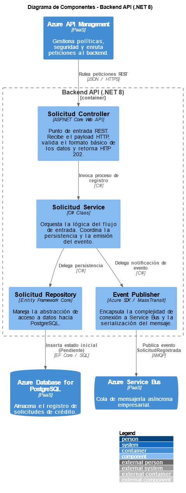

# Modelo C4 - Nivel 3: Componentes

En este nivel hacemos un acercamiento exclusivo al contenedor **Backend API (.NET 8)** para detallar su estructura interna. Aquí se muestra la separación de responsabilidades a través de patrones de diseño clásico (Controlador, Servicio, Repositorio) que garantizan un código limpio y mantenible.

## Diagrama de Componentes Visual



---

## Código Fuente de la Arquitectura (PlantUML)

El siguiente código modela los componentes internos del Backend API utilizando el estándar C4-PlantUML local:

```plantuml
@startuml
!include <C4/C4_Component>

LAYOUT_WITH_LEGEND()

title Diagrama de Componentes - Backend API (.NET 8)

Container(apiGw, "API Gateway", "Ocelot / YARP", "Enruta peticiones al backend.")
ContainerDb(db, "Base de Datos", "PostgreSQL", "Almacena el registro de solicitudes.")
ContainerQueue(broker, "Message Broker", "RabbitMQ", "Cola de mensajería asíncrona.")

Container_Boundary(api, "Backend API (.NET 8)") {
    Component(controller, "Solicitud Controller", "ASP.NET Core Web API", "Punto de entrada REST. Recibe el payload HTTP, valida el formato básico de los datos y retorna el HTTP 202 Accepted.")
    Component(service, "Solicitud Service", "C# Class", "Orquesta la lógica del flujo de entrada. Coordina el guardado en base de datos y ordena la emisión del evento asíncrono.")
    Component(repository, "Solicitud Repository", "Entity Framework Core", "Maneja la abstracción de acceso a datos. Traduce los objetos de dominio a tablas relacionales.")
    Component(publisher, "Event Publisher", "MassTransit / RabbitMQ Client", "Encapsula la complejidad de conexión al broker y la serialización del mensaje.")
}

Rel(apiGw, controller, "Rutea peticiones REST", "JSON / HTTPS")
Rel(controller, service, "Invoca proceso de registro", "C#")
Rel(service, repository, "Delega persistencia", "C#")
Rel(service, publisher, "Delega notificación de evento", "C#")

Rel(repository, db, "Inserta estado inicial (Pendiente)", "EF Core / SQL")
Rel(publisher, broker, "Publica evento SolicitudRegistradaEvent", "AMQP")
@enduml
